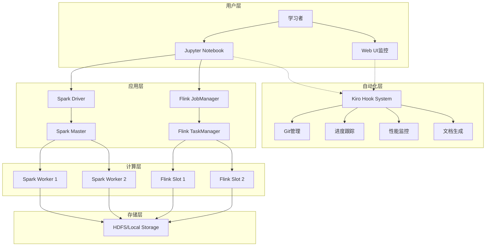
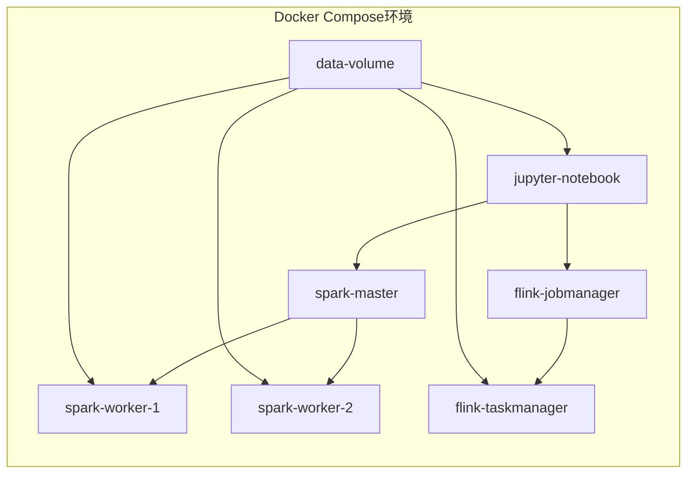

# 设计文档

## 概述

大数据学习平台是一个基于Docker的教学环境，旨在为中文用户提供完整的Apache Spark和Flink学习体验。该平台采用容器化架构，集成了Jupyter Notebook作为交互式学习界面，并通过智能化的Kiro Hook系统实现自动化的学习进度管理和版本控制。

## 架构

### 系统架构图



### 容器架构



## 组件和接口

### 核心组件

#### 1. Docker容器组件

**Jupyter Notebook容器**
- 基础镜像: `jupyter/pyspark-notebook:latest`
- 端口映射: `8888:8888`
- 功能: 提供交互式Python/Scala开发环境
- 集成库: PySpark, Pandas, Matplotlib, Seaborn

**Spark Master容器**
- 基础镜像: `bitnami/spark:3.4`
- 端口映射: `8080:8080`, `7077:7077`
- 功能: Spark集群管理和作业调度
- 配置: 2GB内存，2个CPU核心

**Spark Worker容器**
- 基础镜像: `bitnami/spark:3.4`
- 端口映射: `8081-8082:8081`
- 功能: 执行Spark任务
- 配置: 每个Worker 1GB内存，1个CPU核心

**Flink JobManager容器**
- 基础镜像: `flink:1.17-scala_2.12`
- 端口映射: `8083:8081`
- 功能: Flink作业管理和资源调度
- 配置: 1GB内存

**Flink TaskManager容器**
- 基础镜像: `flink:1.17-scala_2.12`
- 功能: 执行Flink任务
- 配置: 1GB内存，2个任务槽

#### 2. 学习内容组件

**教程模块结构**
```
tutorials/
├── 01-spark-basics/
│   ├── rdd-fundamentals.ipynb
│   ├── dataframe-operations.ipynb
│   └── dataset-api.ipynb
├── 02-spark-sql/
│   ├── sql-basics.ipynb
│   ├── advanced-queries.ipynb
│   └── performance-tuning.ipynb
├── 03-spark-streaming/
│   ├── dstream-basics.ipynb
│   ├── structured-streaming.ipynb
│   └── kafka-integration.ipynb
├── 04-projects/
│   ├── log-analysis/
│   ├── recommendation-system/
│   └── real-time-dashboard/
└── 05-flink/
    ├── datastream-api.ipynb
    ├── table-api.ipynb
    └── spark-vs-flink.ipynb
```

**数据集组件**
```
datasets/
├── sample/
│   ├── sales_data.csv
│   ├── user_behavior.json
│   └── server_logs.txt
├── medium/
│   ├── ecommerce_transactions.parquet
│   ├── social_network.json
│   └── sensor_data.csv
└── large/
    ├── web_clickstream/
    └── financial_data/
```

#### 3. 自动化Hook组件

**Hook管理器**
- 文件: `.kiro/hooks/hook-manager.py`
- 功能: 统一管理所有自动化Hook的执行
- 接口: REST API用于Hook触发和状态查询

**学习进度Hook**
- 文件: `.kiro/hooks/progress-tracker.py`
- 触发条件: Notebook保存、代码执行完成
- 功能: 更新学习进度、生成统计报告

**Git自动化Hook**
- 文件: `.kiro/hooks/git-automation.py`
- 触发条件: 文件变更、学习里程碑
- 功能: 智能提交、标签管理、GitHub同步

**性能监控Hook**
- 文件: `.kiro/hooks/performance-monitor.py`
- 触发条件: Spark/Flink作业执行
- 功能: 收集性能指标、生成优化建议

### 接口设计

#### 1. Hook系统接口

```python
class HookInterface:
    def trigger(self, event_type: str, context: dict) -> bool
    def get_status(self) -> dict
    def configure(self, config: dict) -> bool
```

#### 2. 学习进度接口

```python
class ProgressTracker:
    def update_progress(self, module: str, completion: float)
    def get_current_progress(self) -> dict
    def recommend_next_step(self) -> str
```

#### 3. 性能监控接口

```python
class PerformanceMonitor:
    def collect_metrics(self, job_id: str) -> dict
    def analyze_performance(self, metrics: dict) -> list
    def generate_report(self, analysis: list) -> str
```

## 数据模型

### 学习进度模型

```python
@dataclass
class LearningProgress:
    user_id: str
    module_name: str
    completion_percentage: float
    last_accessed: datetime
    exercises_completed: int
    total_exercises: int
    time_spent: timedelta
    notes: str
```

### 性能指标模型

```python
@dataclass
class PerformanceMetrics:
    job_id: str
    job_type: str  # 'spark' or 'flink'
    start_time: datetime
    end_time: datetime
    duration: timedelta
    memory_usage: float
    cpu_usage: float
    data_processed: int
    success: bool
    error_message: str
```

### Hook配置模型

```python
@dataclass
class HookConfiguration:
    hook_name: str
    enabled: bool
    trigger_events: list[str]
    parameters: dict
    last_execution: datetime
    execution_count: int
```

## 错误处理

### 容器级别错误处理

1. **容器启动失败**
   - 检测机制: Docker健康检查
   - 恢复策略: 自动重启，最多3次
   - 通知方式: Hook系统记录日志

2. **资源不足**
   - 检测机制: 内存和CPU使用率监控
   - 恢复策略: 动态调整容器资源限制
   - 通知方式: 性能监控Hook告警

3. **网络连接问题**
   - 检测机制: 容器间通信测试
   - 恢复策略: 重新创建网络连接
   - 通知方式: 环境状态监控Hook

### 应用级别错误处理

1. **Spark作业失败**
   - 检测机制: 作业状态监控
   - 恢复策略: 自动重试，降级处理
   - 学习辅助: 提供错误分析和解决建议

2. **Notebook执行错误**
   - 检测机制: 代码执行异常捕获
   - 恢复策略: 提供调试信息和修复建议
   - 学习辅助: 自动生成错误解释文档

3. **数据访问错误**
   - 检测机制: 文件系统和数据源连接测试
   - 恢复策略: 备用数据源切换
   - 学习辅助: 数据问题诊断指南

### Hook系统错误处理

1. **Hook执行失败**
   - 检测机制: Hook执行状态监控
   - 恢复策略: 重试机制，失败后禁用
   - 通知方式: 错误日志和用户提醒

2. **Git操作失败**
   - 检测机制: Git命令返回值检查
   - 恢复策略: 冲突解决，备份恢复
   - 通知方式: 详细错误信息和解决步骤

## 测试策略

### 单元测试

1. **Hook功能测试**
   - 测试范围: 每个Hook的核心功能
   - 测试工具: pytest
   - 覆盖率要求: >90%

2. **数据处理测试**
   - 测试范围: Spark和Flink代码示例
   - 测试工具: Spark Testing Base, Flink Test Utilities
   - 测试数据: 小规模示例数据集

### 集成测试

1. **容器集成测试**
   - 测试范围: Docker Compose环境启动和通信
   - 测试工具: Docker Compose Test
   - 测试场景: 完整环境部署和基本功能验证

2. **端到端学习流程测试**
   - 测试范围: 从环境启动到完成学习模块
   - 测试工具: Selenium + pytest
   - 测试场景: 模拟用户完整学习路径

### 性能测试

1. **资源使用测试**
   - 测试指标: CPU、内存、磁盘使用率
   - 测试工具: Docker stats, cAdvisor
   - 基准要求: 在4GB内存环境下正常运行

2. **作业执行性能测试**
   - 测试指标: 作业执行时间、吞吐量
   - 测试工具: Spark History Server, Flink Web UI
   - 基准数据: 不同规模数据集的处理时间

### 用户体验测试

1. **学习路径测试**
   - 测试范围: 教程连贯性和难度递进
   - 测试方法: 用户反馈收集
   - 评估标准: 学习完成率和满意度

2. **Hook自动化测试**
   - 测试范围: 自动化功能的用户感知
   - 测试方法: A/B测试对比
   - 评估标准: 用户学习效率提升程度