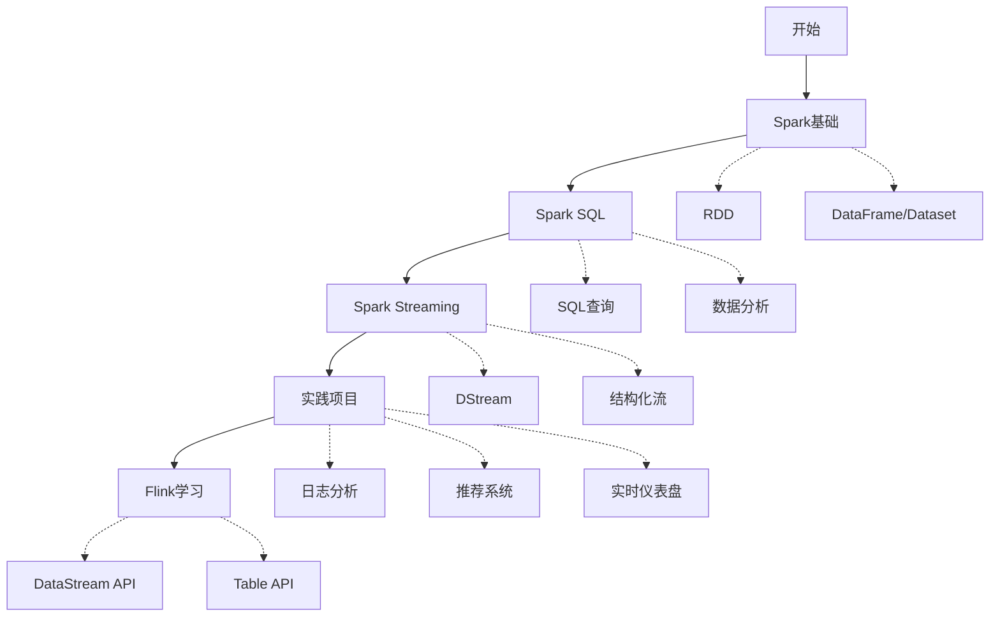

# 大数据学习路径指南

欢迎来到大数据学习平台！本指南将帮助您规划学习路径，从Spark基础知识开始，逐步掌握大数据处理技术。

## 学习路径概览

## 详细学习计划

### 第1阶段：Spark基础 (2-3天)

1. **环境熟悉**
   - 学习笔记本：`00-welcome.ipynb`
   - 目标：熟悉Jupyter环境和Spark连接

2. **RDD基础**
   - 学习笔记本：`01-spark-basics/rdd-fundamentals.ipynb`
   - 目标：理解RDD概念、创建方法和基本操作

3. **DataFrame操作**
   - 学习笔记本：`01-spark-basics/dataframe-operations.ipynb`
   - 目标：掌握DataFrame API和常用转换

4. **Dataset API**
   - 学习笔记本：`01-spark-basics/dataset-api.ipynb`
   - 目标：了解Dataset的类型安全特性和使用场景

### 第2阶段：Spark SQL (2天)

1. **SQL基础**
   - 学习笔记本：`02-spark-sql/sql-basics.ipynb`
   - 目标：学习在Spark中使用SQL查询数据

2. **高级查询**
   - 学习笔记本：`02-spark-sql/advanced-queries.ipynb`
   - 目标：掌握复杂SQL查询和窗口函数

3. **性能调优**
   - 学习笔记本：`02-spark-sql/performance-tuning.ipynb`
   - 目标：了解Spark SQL查询优化技术

### 第3阶段：Spark Streaming (2天)

1. **DStream基础**
   - 学习笔记本：`03-spark-streaming/dstream-basics.ipynb`
   - 目标：理解Spark流处理模型和DStream API

2. **结构化流**
   - 学习笔记本：`03-spark-streaming/structured-streaming.ipynb`
   - 目标：掌握结构化流处理和SQL流查询

3. **Kafka集成**
   - 学习笔记本：`03-spark-streaming/kafka-integration.ipynb`
   - 目标：学习与Kafka集成进行实时数据处理

### 第4阶段：实践项目 (3-5天)

1. **日志分析项目**
   - 项目目录：`04-projects/log-analysis/`
   - 目标：分析服务器日志数据，提取有用信息

2. **推荐系统项目**
   - 项目目录：`04-projects/recommendation-system/`
   - 目标：构建简单的协同过滤推荐系统

3. **实时仪表盘项目**
   - 项目目录：`04-projects/real-time-dashboard/`
   - 目标：创建实时数据可视化仪表盘

### 第5阶段：Flink学习 (2-3天)

1. **Flink基础**
   - 学习笔记本：`05-flink/datastream-api.ipynb`
   - 目标：了解Flink架构和DataStream API

2. **Table API**
   - 学习笔记本：`05-flink/table-api.ipynb`
   - 目标：学习Flink的Table API和SQL支持

3. **Spark与Flink对比**
   - 学习笔记本：`05-flink/spark-vs-flink.ipynb`
   - 目标：理解两个框架的异同和适用场景

## 学习建议

1. **循序渐进**：按照推荐的学习路径逐步学习，确保掌握基础知识后再进入高级主题
2. **动手实践**：每个笔记本都包含练习部分，确保完成所有练习
3. **项目实战**：实践项目是巩固知识的最佳方式，尝试独立完成项目
4. **参考资源**：遇到问题时，参考官方文档和提供的参考资料
5. **记录笔记**：在学习过程中记录重要概念和遇到的问题

## 进度跟踪

| 模块 | 状态 | 完成日期 | 笔记 |
|------|------|----------|------|
| Spark基础 | 未开始 | | |
| Spark SQL | 未开始 | | |
| Spark Streaming | 未开始 | | |
| 实践项目 | 未开始 | | |
| Flink学习 | 未开始 | | |

祝您学习愉快！